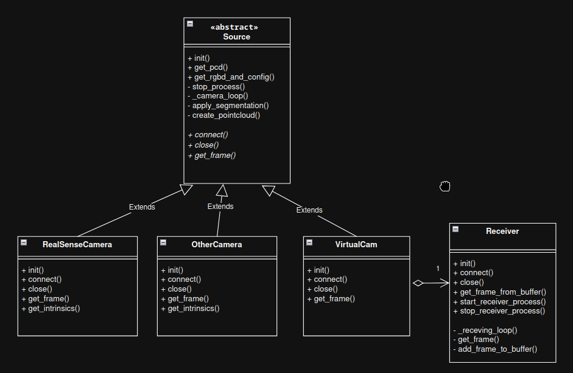
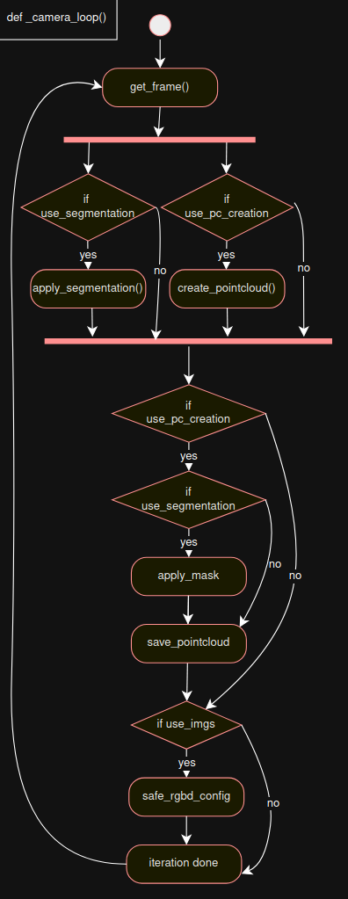

# Source Module Documentation

The **Source** module provides a unified abstraction layer for various image sources —  
for example real cameras (like **Intel RealSense**) or virtual cameras that receive images from another program.  
Each camera runs in its own process and communicates via shared memory, ensuring parallel, thread-safe operation.



---

## Source – Abstract Base Class

### Description
The **Source** class defines the general structure and behavior for all camera implementations.  
It handles process management, shared memory exchange, and optional features like segmentation and point cloud creation.

---

### Key Features
- Abstract base class for camera input types  
- Separate process for image acquisition and processing  
- SharedMemory-based communication  
- Optional segmentation (e.g. YOLO mask generation)  
- Optional point cloud generation  
- Thread-safe control via `multiprocessing.Lock` and `Manager.Namespace`

---

### Constructor Parameters

| Parameter | Type | Description |
|------------|------|-------------|
| `width`, `height` | `int` | Target resolution used for resizing. Reducing these values decreases the image and point count, which improves performance. |
| `use_imgs` | `bool` | Enables writing of RGB and depth images to shared memory. These can then be accessed via `get_rgbd_and_config()`. Disable to save the time required for copying. |
| `use_segmentation` | `bool` | If true, segmentation is triggered via `use_segmentation()`, which calls a server through ZMQ to receive the segmentation mask. |
| `use_pc_creation` | `bool` | Enables point cloud creation. When combined with segmentation, the generated mask is applied to the resulting 3D points. |
| `name` | `str` | Logical name of the camera. |
| `id` | `str` | Identifier or serial number of the camera. |

## Core Method: `_camera_loop()`

This is the **main acquisition loop**, executed in a **separate process** (spawned by `init()`).



---

### Workflow

1. **`get_frame()`**  
   Acquire the latest RGB, depth, and intrinsic parameters.

2. **Resizing**  
   Adjust frames to the configured `width × height`.

3. **Parallel Processing**  
   Launch threads for:
   - `apply_segmentation()` – applies model inference on the image  
   - `create_pointcloud()` – converts depth to 3D points  

4. **Mask Application**  
   If segmentation is active, apply the mask to filter relevant 3D points.

5. **Data Sharing**  
   Write processed data to **SharedMemory** for external access.

6. **State Management**  
   Update flags and synchronization primitives in **Manager.Namespace**.


## 📷 RealSense – Direct Camera Integration

### Description
The **RealSense** class connects directly to an **Intel RealSense** camera attached to the system.  
Other camera types can be supported by implementing a subclass with the same interface and logic.

---

### Relevant Parameters

| Parameter | Description |
|------------|-------------|
| `org_width`, `org_height` | Original resolution of the camera (defined by hardware). |
| `res_width`, `res_height` | Target resolution used for resizing and point cloud generation. |
| `use_imgs` | Enables RGB and depth image sharing (see base class). |
| `use_segmentation` | Enables segmentation (see base class). |
| `use_pc_creation` | Enables point cloud generation (see base class). |
| `id` | Unique camera identifier or serial number. |

---

### Example Usage

```python
upper = s.RealSenseCamera(
    "007522060349",
    org_width=640, org_height=480,
    res_width=640, res_height=480,
    use_imgs=False, use_segmentation=False, use_pc_creation=True
)

dev = "CUDA:0"  # or "CPU:0"
pcd_upper = upper.get_pcd(dev)
```

**Explanation:**
- Creates a **RealSense camera** with a resolution of **640×480**.  
- No resizing is applied (original and target sizes are equal).  
- **Segmentation** is disabled.  
- A **point cloud** is created (all 640×480 points).  
- **RGB-D images** are not copied to shared memory → improves performance.  
- `get_pcd()` returns `True` if a new point cloud is available, otherwise `None`.

⚙️ *FPS for camera initalisation is at the moment hardcoded, and must be changed in the code*


## 🎥 VirtualCam – Receiving Data from Another Program

### Description
The **VirtualCam** class behaves like a real camera but receives images via a **ZMQ socket** from another program or computer.  
This allows external processes to stream camera data into the system seamlessly.

---

### Relevant Parameters

| Parameter | Description |
|------------|-------------|
| `name` | Camera name; must match the one sent by the data sender (used as key in the receiver buffer). |
| `streamer` | A `Receiver` object that handles the network data reception. |
| `width`, `height` | Target resolution for processing. |
| `use_imgs`, `use_segmentation`, `use_pc_creation` | Behave identically to those in `Source`. |

### Example Usage

```python
streamer = s.Receiver("10.42.0.27", 35555)

upper = s.VirtualCamera(
    "upper_cam",
    streamer,
    400, 480,
    use_imgs=False, use_segmentation=False, use_pc_creation=True
)

down = s.VirtualCamera(
    "down_cam",
    streamer,
    400, 480,
    use_imgs=False, use_segmentation=False, use_pc_creation=True
)
```

This setup creates a server via the streamer to receive the data and registers two virtual cameras (upper_cam, down_cam).
Each one can be accessed just like a real camera through the same interface (e.g. get_pcd()).

## 🛰️ Receiver – ZMQ Data Server

### Description
The **Receiver** class creates a **ZMQ PULL** socket that listens for incoming data from clients.  
Each received packet contains **RGB** and **depth** images plus intrinsic parameters, which are unpacked and stored in a **shared buffer**.  
**Virtual cameras** access their data from this buffer.

---

### Relevant Parameters

| Parameter | Description |
|------------|-------------|
| `address` | IP address to bind the receiver (e.g. `"10.42.0.27"`). |
| `port` | Port for incoming connections. |

---

### Packet Structure

Each incoming packet contains the following information:

| Field | Type | Description |
|--------|------|-------------|
| `str_len` | `uint32` | Length of the camera name string. |
| `name` | `string` | UTF-8 encoded camera name. |
| `h`, `w` | `uint32` | Image height and width. |
| `rgb_len` | `uint32` | Size of RGB data in bytes. |
| `rgb_bytes` | `byte[]` | Raw RGB image data. |
| `depth_len` | `uint32` | Size of depth data in bytes. |
| `depth_bytes` | `byte[]` | Raw depth image data. |
| `fx`, `fy`, `cx`, `cy` | `float32[4]` | Camera intrinsic parameters. |
