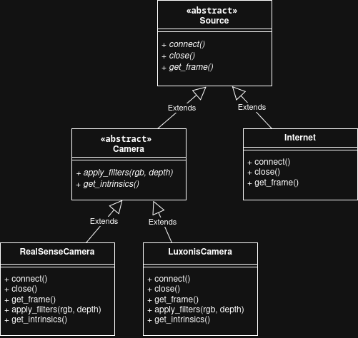

# Documentation

## Streamer
The streamer is implemented in python (see [python](../python)) and responsible for reading the data out of a source and send it to the Meta Quest. There a 3 important Abstract Concepts: Source, ProcessingStep and Action, which are represented as ABCs in the python code. These 3 classes can be seen as a processing pipeline. First data is read with Source, then proceessed with ProcessingStep and then different Actions are made with this data. You can find a example how a streamer can be defined in [examples](../examples).

### Source
With the Class Source sources are defined, which can be for example different Cameras or a other Streamer in the Internet.

### ProcessingStep
With ProcessingStep several processingsteps can be connected. These ProcessingSteps are always executed in order, so the output of the first is the input for the second, ...

### Actions
Actions are the last Piece of the Processing Pipeline. Here you can see a ShowImage, which opens a window to see depth and rgb data. Additionally there is the ZMQPublisher, that class is responsible for sending the data to the Meta Quest.

## Meta Quest
On Meta Quest the pointcloud is generation via compute shader based on the rgb and depth image. Instanced Rendering and an own shader are used to render the cubes efficient.

